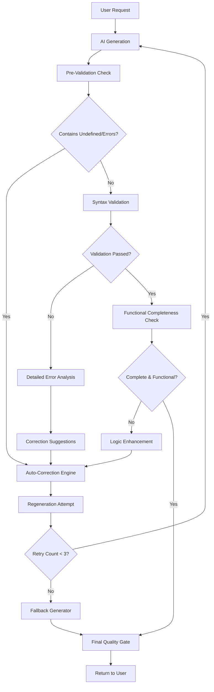

# Design Document

## Overview

The AI Generation Quality Assurance system will implement comprehensive validation, error detection, and automatic correction mechanisms to ensure all AI-generated Cadence contracts are syntactically correct, functionally complete, and production-ready. This system builds upon the existing migration infrastructure to create a robust quality gate that prevents undefined values, syntax errors, and incomplete code from reaching users.

## Architecture

### Quality Assurance Pipeline Architecture



### Component Integration Flow

1. **Generation Request Handler** receives user prompts and context
2. **AI Generation Engine** produces initial code using enhanced prompts
3. **Pre-Validation Scanner** detects obvious issues like undefined values
4. **Auto-Correction Engine** attempts to fix detected issues automatically
5. **Comprehensive Validator** performs deep syntax and logic validation
6. **Fallback Generator** provides guaranteed-working code when all else fails
7. **Quality Reporter** logs metrics and provides user feedback

## Components and Interfaces

### Core Quality Assurance Components

#### 1. Enhanced Generation Controller
```typescript
interface EnhancedGenerationController {
  generateWithQualityAssurance(request: GenerationRequest): Promise<QualityAssuredResult>
  validateAndCorrect(code: string, context: GenerationContext): Promise<CorrectionResult>
  getFallbackCode(prompt: string, type: ContractType): string
  reportQualityMetrics(result: QualityAssuredResult): void
}

interface GenerationRequest {
  prompt: string
  context?: string
  temperature?: number
  maxRetries?: number
  strictMode?: boolean
}

interface QualityAssuredResult {
  code: string
  qualityScore: number
  validationResults: ValidationResult[]
  correctionHistory: CorrectionAttempt[]
  fallbackUsed: boolean
  generationMetrics: GenerationMetrics
}
```

#### 2. Pre-Validation Scanner
```typescript
interface PreValidationScanner {
  scanForUndefinedValues(code: string): UndefinedValueIssue[]
  detectSyntaxErrors(code: string): SyntaxError[]
  checkCodeCompleteness(code: string): CompletenessIssue[]
  validateBasicStructure(code: string): StructureValidation
}

interface UndefinedValueIssue {
  location: CodeLocation
  context: string
  suggestedFix: string
  severity: 'critical' | 'warning'
}

interface CompletenessIssue {
  missingElement: 'function' | 'initialization' | 'event' | 'interface'
  description: string
  requiredForType: ContractType
  autoFixable: boolean
}
```

#### 3. Auto-Correction Engine
```typescript
interface AutoCorrectionEngine {
  correctUndefinedValues(code: string): CorrectionResult
  fixSyntaxErrors(code: string): CorrectionResult
  enhanceIncompleteLogic(code: string, context: GenerationContext): CorrectionResult
  validateCorrections(originalCode: string, correctedCode: string): CorrectionValidation
}

interface CorrectionResult {
  correctedCode: string
  correctionsApplied: Correction[]
  confidence: number
  requiresRegeneration: boolean
  success: boolean
}

interface Correction {
  type: 'undefined-fix' | 'syntax-fix' | 'logic-enhancement' | 'structure-fix'
  location: CodeLocation
  originalValue: string
  correctedValue: string
  reasoning: string
}
```

#### 4. Comprehensive Code Validator
```typescript
interface ComprehensiveValidator {
  validateSyntax(code: string): SyntaxValidationResult
  validateLogic(code: string, contractType: ContractType): LogicValidationResult
  validateCompleteness(code: string, requirements: ContractRequirements): CompletenessValidationResult
  validateBestPractices(code: string): BestPracticesValidationResult
  generateQualityScore(validationResults: ValidationResult[]): QualityScore
}

interface QualityScore {
  overall: number // 0-100
  syntax: number
  logic: number
  completeness: number
  bestPractices: number
  productionReadiness: number
}
```

#### 5. Intelligent Fallback Generator
```typescript
interface FallbackGenerator {
  generateFallbackContract(prompt: string, contractType: ContractType): string
  getTemplateBasedFallback(requirements: ContractRequirements): string
  createMinimalWorkingContract(basicRequirements: BasicRequirements): string
  validateFallbackQuality(code: string): boolean
}

interface ContractType {
  category: 'nft' | 'fungible-token' | 'utility' | 'dao' | 'marketplace' | 'generic'
  complexity: 'simple' | 'intermediate' | 'advanced'
  features: string[]
}
```

#### 6. Generation Metrics Collector
```typescript
interface MetricsCollector {
  recordGenerationAttempt(request: GenerationRequest, result: QualityAssuredResult): void
  trackQualityTrends(): QualityTrends
  identifyCommonIssues(): IssuePattern[]
  generateQualityReport(): QualityReport
}

interface GenerationMetrics {
  attemptCount: number
  totalGenerationTime: number
  validationTime: number
  correctionTime: number
  finalQualityScore: number
  issuesDetected: number
  issuesFixed: number
}
```

### Enhanced AI Prompt System

#### Dynamic Prompt Enhancement
```typescript
interface PromptEnhancer {
  enhancePromptForQuality(basePrompt: string, context: GenerationContext): string
  addQualityConstraints(prompt: string, previousFailures: FailurePattern[]): string
  incorporateLearnings(prompt: string, qualityHistory: QualityHistory): string
}

interface QualityConstraints {
  syntaxRequirements: string[]
  completenessRequirements: string[]
  bestPracticeRequirements: string[]
  errorPreventionRules: string[]
}
```

### Error Detection and Classification

#### Undefined Value Detection
```typescript
interface UndefinedDetector {
  detectUndefinedKeywords(code: string): UndefinedPattern[]
  detectIncompleteStatements(code: string): IncompleteStatement[]
  detectMissingValues(code: string): MissingValue[]
  classifyUndefinedSeverity(pattern: UndefinedPattern): Severity
}

interface UndefinedPattern {
  type: 'literal-undefined' | 'incomplete-expression' | 'missing-initialization'
  location: CodeLocation
  context: string
  autoFixable: boolean
  suggestedFix: string
}
```

#### Syntax Error Detection
```typescript
interface SyntaxErrorDetector {
  detectBracketMismatches(code: string): BracketError[]
  detectIncompleteStatements(code: string): IncompleteStatement[]
  detectInvalidKeywords(code: string): KeywordError[]
  detectTypeErrors(code: string): TypeError[]
}

interface BracketError {
  type: 'missing-open' | 'missing-close' | 'mismatched'
  location: CodeLocation
  expectedBracket: string
  actualBracket?: string
}
```

## Data Models

### Quality Assurance Configuration
```typescript
interface QualityConfig {
  maxRetryAttempts: number
  qualityThreshold: number
  enableAutoCorrection: boolean
  enableFallbackGeneration: boolean
  strictValidation: boolean
  customValidationRules: ValidationRule[]
}

interface ValidationRule {
  name: string
  pattern: RegExp
  severity: 'error' | 'warning' | 'info'
  message: string
  autoFix?: (match: string) => string
}
```

### Generation Context
```typescript
interface GenerationContext {
  userPrompt: string
  contractType: ContractType
  previousAttempts: GenerationAttempt[]
  qualityRequirements: QualityRequirements
  userExperience: 'beginner' | 'intermediate' | 'expert'
}

interface QualityRequirements {
  minimumQualityScore: number
  requiredFeatures: string[]
  prohibitedPatterns: string[]
  performanceRequirements: PerformanceRequirements
}
```

### Quality Metrics
```typescript
interface QualityMetrics {
  generationSuccess: {
    firstAttempt: number
    afterCorrection: number
    fallbackUsed: number
  }
  commonIssues: {
    undefinedValues: number
    syntaxErrors: number
    incompleteLogic: number
    validationFailures: number
  }
  averageQualityScore: number
  userSatisfaction: number
}
```

## Error Handling

### Generation Error Categories

#### 1. Pre-Generation Errors
- **Invalid Prompts**: Prompts that are too vague or contradictory
- **Context Issues**: Missing or conflicting context information
- **Configuration Errors**: Invalid generation parameters

#### 2. Generation Errors
- **AI Service Failures**: API timeouts, rate limits, service unavailability
- **Model Errors**: Unexpected model responses or formatting issues
- **Token Limit Exceeded**: Prompts or responses exceeding model limits

#### 3. Post-Generation Errors
- **Validation Failures**: Code that fails syntax or logic validation
- **Correction Failures**: Auto-correction attempts that introduce new errors
- **Quality Threshold Failures**: Code that doesn't meet minimum quality standards

### Error Recovery Strategies

#### Progressive Correction Approach
1. **Immediate Fixes**: Handle obvious issues like undefined values
2. **Syntax Correction**: Fix bracket mismatches and keyword errors
3. **Logic Enhancement**: Add missing functionality and improve completeness
4. **Regeneration**: Create new code with enhanced prompts
5. **Fallback**: Use template-based guaranteed working code

#### Quality Gate System
```typescript
interface QualityGate {
  name: string
  validator: (code: string) => boolean
  errorHandler: (code: string) => CorrectionResult
  fallbackStrategy: FallbackStrategy
}

enum FallbackStrategy {
  REGENERATE = 'regenerate',
  AUTO_CORRECT = 'auto-correct',
  USE_TEMPLATE = 'use-template',
  FAIL_GRACEFULLY = 'fail-gracefully'
}
```

## Testing Strategy

### Unit Testing Approach

#### 1. Pre-Validation Scanner Tests
```typescript
describe('PreValidationScanner', () => {
  test('detects undefined values in generated code', () => {
    const codeWithUndefined = 'access(all) var value: String = undefined'
    const issues = scanner.scanForUndefinedValues(codeWithUndefined)
    expect(issues).toHaveLength(1)
    expect(issues[0].severity).toBe('critical')
  })
  
  test('identifies incomplete function definitions', () => {
    const incompleteCode = 'access(all) fun getValue(): String {'
    const issues = scanner.checkCodeCompleteness(incompleteCode)
    expect(issues.some(i => i.missingElement === 'function')).toBe(true)
  })
})
```

#### 2. Auto-Correction Engine Tests
```typescript
describe('AutoCorrectionEngine', () => {
  test('fixes undefined values with appropriate defaults', () => {
    const input = 'access(all) var name: String = undefined'
    const result = corrector.correctUndefinedValues(input)
    expect(result.success).toBe(true)
    expect(result.correctedCode).toContain('= ""')
  })
  
  test('corrects bracket mismatches', () => {
    const input = 'access(all) fun test() { return "value"'
    const result = corrector.fixSyntaxErrors(input)
    expect(result.correctedCode).toContain('}')
  })
})
```

#### 3. Quality Score Calculation Tests
```typescript
describe('QualityScoreCalculator', () => {
  test('calculates accurate quality scores', () => {
    const perfectCode = generatePerfectContract()
    const score = calculator.generateQualityScore(perfectCode)
    expect(score.overall).toBeGreaterThan(95)
    expect(score.productionReadiness).toBe(100)
  })
})
```

### Integration Testing

#### End-to-End Quality Assurance Testing
- Full generation pipeline with quality gates
- Error recovery and fallback mechanisms
- Performance under various failure scenarios

#### Regression Testing
- Ensure quality improvements don't break existing functionality
- Validate that common issues are consistently prevented
- Test edge cases and unusual prompt patterns

### Performance Testing

#### Generation Speed Testing
- Measure impact of quality checks on generation time
- Optimize validation algorithms for sub-100ms response
- Test concurrent generation requests

#### Quality Consistency Testing
- Ensure consistent quality across different prompt types
- Validate quality scores correlate with actual code quality
- Test quality maintenance under high load

## Implementation Phases

### Phase 1: Core Quality Infrastructure
- Implement pre-validation scanner for undefined values and basic syntax
- Create auto-correction engine for common issues
- Establish quality scoring system

### Phase 2: Enhanced Validation System
- Implement comprehensive syntax and logic validation
- Create intelligent error classification and correction
- Add fallback generation system

### Phase 3: AI Prompt Enhancement
- Develop dynamic prompt enhancement based on quality history
- Implement learning system for common failure patterns
- Create context-aware generation optimization

### Phase 4: Metrics and Monitoring
- Implement comprehensive quality metrics collection
- Create quality trend analysis and reporting
- Add user feedback integration for continuous improvement

### Phase 5: Advanced Features
- Implement contract-type-specific validation rules
- Create intelligent template selection for fallbacks
- Add predictive quality assessment before generation

### Phase 6: Production Optimization
- Optimize performance for production workloads
- Implement advanced caching and optimization strategies
- Create comprehensive monitoring and alerting system