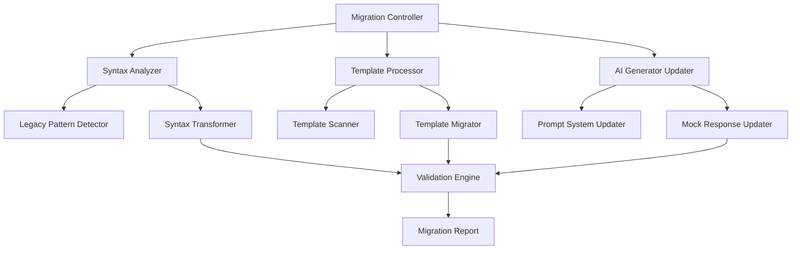

# Design Document

## Overview

The Cadence Syntax Migration feature will systematically update all legacy Cadence contracts in the VibeMore platform to use modern Cadence 1.0 syntax. This migration ensures compatibility with the current Flow blockchain environment while preserving all existing functionality. The design focuses on automated syntax transformation, comprehensive validation, and seamless integration with the existing AI code generation system.

## Architecture

### Migration Engine Architecture



### Component Interaction Flow

1. **Migration Controller** orchestrates the entire migration process
2. **Syntax Analyzer** identifies legacy patterns and applies transformations
3. **Template Processor** handles the contract templates in `lib/templates.ts`
4. **AI Generator Updater** modifies the VibeSDK to generate modern syntax
5. **Validation Engine** ensures migrated contracts maintain functionality

## Components and Interfaces

### Core Migration Components

#### 1. Migration Controller
```typescript
interface MigrationController {
  executeMigration(): Promise<MigrationResult>
  validateMigration(): Promise<ValidationResult>
  generateReport(): MigrationReport
}
```

#### 2. Syntax Transformer
```typescript
interface SyntaxTransformer {
  transformAccessModifiers(code: string): string
  transformInterfaceConformance(code: string): string
  transformStorageAPI(code: string): string
  transformFunctionSignatures(code: string): string
  transformImportStatements(code: string): string
}
```

#### 3. Template Migrator
```typescript
interface TemplateMigrator {
  migrateTemplate(template: Template): Template
  validateTemplate(template: Template): ValidationResult
  updateTemplateMetadata(template: Template): Template
}
```

#### 4. AI Generator Updater
```typescript
interface AIGeneratorUpdater {
  updateSystemPrompts(): void
  updateMockResponses(): void
  validateGeneratedCode(code: string): ValidationResult
}
```

#### 5. Real-time Validation Engine
```typescript
interface RealtimeValidator {
  validateUserInput(code: string): ValidationResult
  generateModernizationSuggestions(code: string): ModernizationSuggestion[]
  autoModernizeCode(code: string): ModernizationResult
  provideLegacyPatternEducation(pattern: string): EducationalContent
}

interface ModernizationSuggestion {
  pattern: string
  modernReplacement: string
  explanation: string
  example: CodeExample
}

interface ModernizationResult {
  originalCode: string
  modernizedCode: string
  transformationsApplied: string[]
  confidence: number
  requiresManualReview: boolean
}
```

#### 6. Comprehensive Pattern Detector
```typescript
interface PatternDetector {
  detectAllLegacyPatterns(code: string): LegacyPattern[]
  categorizePatterns(patterns: LegacyPattern[]): PatternCategory[]
  prioritizeFixesByImpact(patterns: LegacyPattern[]): PrioritizedFix[]
  generateFixPlan(code: string): FixPlan
}

interface LegacyPattern {
  type: 'access-modifier' | 'storage-api' | 'interface-conformance' | 'function-signature'
  location: CodeLocation
  severity: 'critical' | 'warning' | 'suggestion'
  description: string
  suggestedFix: string
}
```

### Syntax Transformation Rules

#### Access Modifier Transformations
- `pub` → `access(all)`
- `pub(set)` → `access(all)` with setter restrictions
- `access(self)` → maintained as-is
- `access(contract)` → maintained as-is
- `access(account)` → maintained as-is

#### Interface Conformance Updates
- `Resource: Interface1, Interface2` → `Resource: Interface1 & Interface2`
- Multiple interface inheritance syntax modernization
- Entitlement-based access control integration

#### Storage API Modernization
- `account.save()` → `account.storage.save()`
- `account.link()` → `account.capabilities.storage.issue()` + `account.capabilities.publish()`
- `account.borrow()` → `account.capabilities.borrow()`
- Capability-based access pattern updates

#### Function Signature Updates
- Parameter type positioning adjustments
- Return type syntax modernization
- View function declarations: `access(all) view fun`
- Entitlement-based function access: `access(NonFungibleToken.Withdraw)`

## Data Models

### Migration Configuration
```typescript
interface MigrationConfig {
  targetCadenceVersion: string
  preserveComments: boolean
  validateAfterMigration: boolean
  backupOriginals: boolean
  transformationRules: TransformationRule[]
}

interface TransformationRule {
  pattern: RegExp
  replacement: string
  description: string
  category: 'access-modifier' | 'interface' | 'storage' | 'function' | 'import'
}
```

### Migration Result
```typescript
interface MigrationResult {
  success: boolean
  migratedFiles: string[]
  errors: MigrationError[]
  warnings: MigrationWarning[]
  statistics: MigrationStatistics
}

interface MigrationStatistics {
  totalFilesProcessed: number
  successfulMigrations: number
  failedMigrations: number
  transformationsApplied: number
  linesOfCodeMigrated: number
}
```

### Template Migration Model
```typescript
interface TemplateMigrationResult {
  originalTemplate: Template
  migratedTemplate: Template
  transformationsApplied: string[]
  validationResult: ValidationResult
}
```

## Error Handling

### Migration Error Categories

#### 1. Syntax Transformation Errors
- **Pattern Match Failures**: When legacy patterns cannot be automatically transformed
- **Ambiguous Syntax**: Cases requiring manual intervention
- **Complex Logic**: Advanced patterns needing custom handling

#### 2. Template Processing Errors
- **Template Structure Issues**: Malformed template definitions
- **Code Validation Failures**: Migrated code that doesn't compile
- **Metadata Inconsistencies**: Template metadata not matching migrated code

#### 3. AI Generator Update Errors
- **Prompt System Failures**: Issues updating system prompts
- **Mock Response Validation**: Generated mock responses using legacy syntax
- **Integration Testing Failures**: AI-generated code not meeting standards

### Error Recovery Strategies

#### Graceful Degradation
- Continue migration process even if individual templates fail
- Maintain detailed error logs for manual review
- Preserve original templates as backup

#### Validation Checkpoints
- Pre-migration syntax validation
- Post-migration compilation checks
- Functional equivalence verification

#### Rollback Mechanisms
- Automatic backup creation before migration
- Selective rollback for failed migrations
- Version control integration for change tracking

## Testing Strategy

### Unit Testing Approach

#### 1. Syntax Transformer Tests
```typescript
describe('SyntaxTransformer', () => {
  test('transforms pub to access(all)', () => {
    const input = 'pub fun getValue(): String'
    const expected = 'access(all) fun getValue(): String'
    expect(transformer.transformAccessModifiers(input)).toBe(expected)
  })
  
  test('transforms interface conformance', () => {
    const input = 'resource Vault: Provider, Receiver'
    const expected = 'resource Vault: Provider & Receiver'
    expect(transformer.transformInterfaceConformance(input)).toBe(expected)
  })
})
```

#### 2. Template Migration Tests
```typescript
describe('TemplateMigrator', () => {
  test('migrates fungible token template', () => {
    const originalTemplate = templates.find(t => t.id === 'fungible-token')
    const result = migrator.migrateTemplate(originalTemplate)
    expect(result.code).not.toContain('pub ')
    expect(result.code).toContain('access(all)')
  })
})
```

#### 3. AI Generator Tests
```typescript
describe('AIGeneratorUpdater', () => {
  test('generates modern Cadence syntax', async () => {
    const prompt = 'Create a simple NFT contract'
    const result = await vibeSDK.generateCode({ prompt })
    expect(result).not.toContain('pub ')
    expect(result).toContain('access(all)')
  })
})
```

### Integration Testing

#### End-to-End Migration Testing
- Full migration pipeline execution
- Template functionality verification
- AI generation consistency checks

#### Regression Testing
- Ensure existing functionality remains intact
- Verify no breaking changes in API contracts
- Validate user experience consistency

### Validation Testing

#### Cadence Compilation Testing
- All migrated contracts must compile successfully
- No syntax errors in generated code
- Proper import resolution

#### Functional Equivalence Testing
- Migrated contracts maintain original behavior
- Resource ownership patterns preserved
- Event emission consistency

#### Real-time Validation Testing
- User input validation responds within 100ms
- Modernization suggestions are accurate and helpful
- Auto-modernization maintains code functionality
- Educational content is contextually relevant

#### Comprehensive Pattern Detection Testing
- All known legacy patterns are detected correctly
- False positive rate is below 5%
- Suggested fixes are syntactically correct
- Pattern categorization is accurate

## Implementation Phases

### Phase 1: Core Migration Infrastructure
- Implement syntax transformation engine
- Create migration controller framework
- Establish error handling and logging

### Phase 2: Template Migration
- Migrate all templates in `lib/templates.ts`
- Validate migrated template functionality
- Update template metadata and descriptions

### Phase 3: AI Generator Updates
- Update VibeSDK system prompts
- Modernize mock response generation
- Implement validation for AI-generated code

### Phase 4: Integration and Testing
- Comprehensive testing of migrated system
- Performance validation
- User acceptance testing preparation

### Phase 5: Enhanced Validation and Prevention System
- Implement real-time syntax validation across all user interactions
- Create comprehensive legacy pattern detection and prevention
- Add educational modernization guidance and suggestions
- Implement automatic code modernization where possible

### Phase 6: Documentation and Deployment
- Update documentation to reflect changes
- Create migration guide for users
- Deploy updated system with monitoring