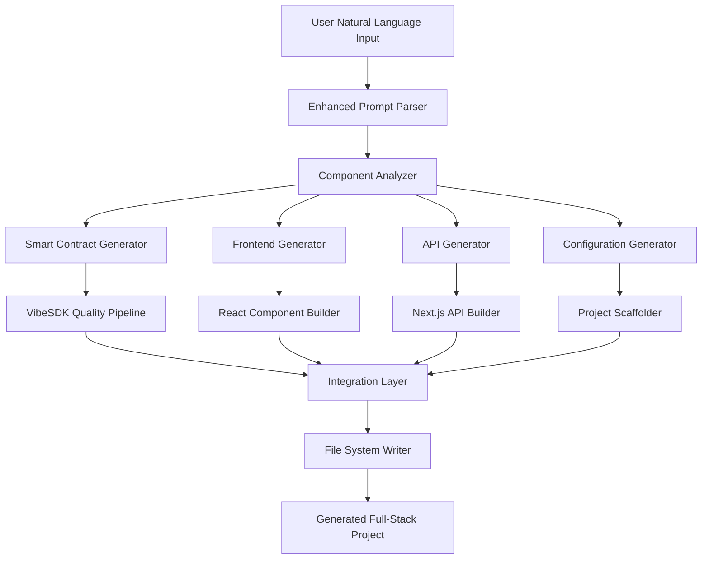
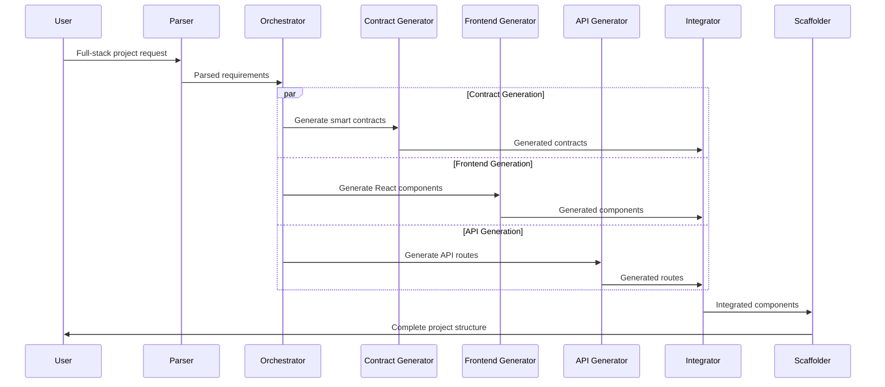

# Design Document

## Overview

The full-stack dApp builder transforms VibeMore from a smart contract generator into a comprehensive development platform that generates complete decentralized applications. Users will describe their dApp concept in natural language, and the system will generate both Cadence smart contracts and React frontend interfaces with proper integration, styling, and deployment configurations.

The system extends the existing VibeSDK architecture to support multi-component generation, maintains the current quality assurance pipeline, and leverages the existing Next.js infrastructure while adding new capabilities for frontend generation and project scaffolding.

## Architecture

### High-Level Architecture



### System Components

1. **Enhanced Prompt Parser**: Analyzes user input to identify backend and frontend requirements
2. **Component Analyzer**: Determines what components need to be generated (contracts, UI, API, config)
3. **Multi-Generator Orchestrator**: Coordinates generation of different component types
4. **Integration Layer**: Ensures proper connections between smart contracts and frontend
5. **Project Scaffolder**: Creates complete project structure with configurations

### Data Flow

1. User provides comprehensive dApp description
2. System parses requirements and identifies component needs
3. Parallel generation of smart contracts, React components, and API routes
4. Integration layer connects components with proper imports and configurations
5. Project scaffolder creates complete file structure
6. Quality assurance validates entire project

## Components and Interfaces

### Enhanced VibeSDK Interface

```typescript
interface FullStackGenerationOptions extends GenerateCodeOptions {
  includeFrontend: boolean
  includeAPI: boolean
  uiFramework: 'react' | 'next'
  stylingFramework: 'tailwind' | 'css'
  deploymentTarget: 'vercel' | 'netlify' | 'self-hosted'
  projectName: string
}

interface FullStackGenerationResult {
  smartContracts: GeneratedContract[]
  frontendComponents: GeneratedComponent[]
  apiRoutes: GeneratedAPIRoute[]
  configurations: GeneratedConfig[]
  projectStructure: ProjectStructure
  integrationCode: IntegrationCode
}

interface GeneratedContract {
  filename: string
  code: string
  validation: ValidationResult
  dependencies: string[]
}

interface GeneratedComponent {
  filename: string
  code: string
  componentType: 'page' | 'component' | 'layout'
  dependencies: string[]
  contractIntegrations: ContractIntegration[]
}

interface GeneratedAPIRoute {
  filename: string
  code: string
  endpoint: string
  methods: string[]
  contractCalls: string[]
}

interface ContractIntegration {
  contractName: string
  functions: string[]
  events: string[]
  integrationCode: string
}
```

### Frontend Generation Engine

```typescript
interface ReactComponentGenerator {
  generateComponent(
    componentSpec: ComponentSpecification,
    contractIntegrations: ContractIntegration[]
  ): GeneratedComponent
  
  generatePage(
    pageSpec: PageSpecification,
    contractIntegrations: ContractIntegration[]
  ): GeneratedComponent
  
  generateLayout(
    layoutSpec: LayoutSpecification
  ): GeneratedComponent
}

interface ComponentSpecification {
  name: string
  type: 'form' | 'display' | 'interaction' | 'navigation'
  props: ComponentProp[]
  styling: StylingRequirements
  contractFunctions: string[]
}

interface StylingRequirements {
  framework: 'tailwind' | 'css'
  theme: 'light' | 'dark' | 'auto'
  responsive: boolean
  accessibility: boolean
}
```

### API Generation Engine

```typescript
interface APIRouteGenerator {
  generateRoute(
    routeSpec: APIRouteSpecification,
    contractIntegrations: ContractIntegration[]
  ): GeneratedAPIRoute
  
  generateMiddleware(
    middlewareSpec: MiddlewareSpecification
  ): GeneratedMiddleware
}

interface APIRouteSpecification {
  path: string
  methods: HTTPMethod[]
  contractCalls: ContractCall[]
  validation: ValidationSchema
  authentication: boolean
}

interface ContractCall {
  contractName: string
  functionName: string
  parameters: Parameter[]
  returnType: string
}
```

### Project Scaffolding Engine

```typescript
interface ProjectScaffolder {
  createProjectStructure(
    projectName: string,
    components: GeneratedComponent[],
    contracts: GeneratedContract[],
    apiRoutes: GeneratedAPIRoute[]
  ): ProjectStructure
  
  generatePackageJson(dependencies: Dependency[]): PackageJsonConfig
  generateNextConfig(requirements: ProjectRequirements): NextConfigFile
  generateTailwindConfig(customizations: TailwindCustomizations): TailwindConfig
}

interface ProjectStructure {
  directories: Directory[]
  files: GeneratedFile[]
  configurations: ConfigurationFile[]
}
```

## Data Models

### Project Generation Request

```typescript
interface FullStackProjectRequest {
  description: string
  projectName: string
  features: FeatureRequirement[]
  uiRequirements: UIRequirements
  deploymentRequirements: DeploymentRequirements
  advancedOptions: AdvancedOptions
}

interface FeatureRequirement {
  type: 'nft' | 'token' | 'marketplace' | 'dao' | 'defi' | 'custom'
  specifications: Record<string, any>
  priority: 'high' | 'medium' | 'low'
}

interface UIRequirements {
  pages: PageRequirement[]
  components: ComponentRequirement[]
  styling: StylingPreferences
  responsive: boolean
  accessibility: boolean
}

interface PageRequirement {
  name: string
  route: string
  purpose: string
  contractInteractions: string[]
  layout: string
}
```

### Generated Project Structure

```typescript
interface GeneratedProject {
  metadata: ProjectMetadata
  smartContracts: {
    [filename: string]: GeneratedContract
  }
  frontend: {
    pages: { [filename: string]: GeneratedComponent }
    components: { [filename: string]: GeneratedComponent }
    layouts: { [filename: string]: GeneratedComponent }
  }
  api: {
    [filename: string]: GeneratedAPIRoute
  }
  configurations: {
    [filename: string]: ConfigurationFile
  }
  documentation: {
    readme: string
    apiDocs: string
    deploymentGuide: string
  }
}

interface ProjectMetadata {
  name: string
  description: string
  version: string
  author: string
  createdAt: Date
  framework: string
  blockchain: string
  dependencies: Dependency[]
}
```

## Error Handling

### Generation Error Types

```typescript
enum FullStackGenerationError {
  PARSING_ERROR = 'parsing_error',
  CONTRACT_GENERATION_ERROR = 'contract_generation_error',
  FRONTEND_GENERATION_ERROR = 'frontend_generation_error',
  API_GENERATION_ERROR = 'api_generation_error',
  INTEGRATION_ERROR = 'integration_error',
  SCAFFOLDING_ERROR = 'scaffolding_error',
  VALIDATION_ERROR = 'validation_error'
}

interface GenerationErrorHandler {
  handleError(error: FullStackGenerationError, context: ErrorContext): ErrorRecoveryAction
  provideFallback(failedComponent: ComponentType): FallbackComponent
  suggestFixes(errors: GenerationError[]): FixSuggestion[]
}
```

### Error Recovery Strategies

1. **Component-Level Fallbacks**: If frontend generation fails, provide basic templates
2. **Progressive Enhancement**: Start with minimal viable product, add features incrementally
3. **Graceful Degradation**: Remove problematic features while maintaining core functionality
4. **User Guidance**: Provide clear error messages and suggestions for fixing issues

## Testing Strategy

### Multi-Layer Testing Approach

1. **Unit Testing**
   - Individual generator components
   - Integration utilities
   - Validation functions
   - Template rendering

2. **Integration Testing**
   - Contract-to-frontend integration
   - API route functionality
   - End-to-end project generation
   - Cross-component communication

3. **System Testing**
   - Complete project generation workflows
   - Deployment pipeline validation
   - Performance under load
   - Error handling scenarios

4. **User Acceptance Testing**
   - Generated project functionality
   - Code quality and readability
   - Development experience
   - Deployment success rates

### Test Data and Scenarios

```typescript
interface TestScenario {
  name: string
  description: string
  input: FullStackProjectRequest
  expectedOutput: GeneratedProject
  validationCriteria: ValidationCriteria[]
}

interface ValidationCriteria {
  type: 'compilation' | 'functionality' | 'integration' | 'performance'
  requirements: string[]
  acceptanceCriteria: string[]
}
```

### Quality Metrics

- **Code Quality Score**: Automated analysis of generated code
- **Integration Success Rate**: Percentage of successful contract-frontend integrations
- **Compilation Success Rate**: Percentage of projects that compile without errors
- **Deployment Success Rate**: Percentage of projects that deploy successfully
- **User Satisfaction Score**: Feedback on generated project quality

## Implementation Architecture

### Enhanced API Endpoints

1. **POST /api/generate-fullstack**
   - Accepts full-stack project requests
   - Returns complete project structure
   - Includes progress tracking

2. **POST /api/generate-component**
   - Generates individual React components
   - Integrates with existing contracts
   - Returns component code and dependencies

3. **POST /api/generate-api-route**
   - Creates Next.js API routes
   - Includes Flow blockchain integration
   - Handles authentication and validation

4. **GET /api/project-templates**
   - Returns available project templates
   - Includes full-stack examples
   - Supports filtering and search

### File Generation Pipeline



### Integration Patterns

1. **Contract-to-Component Binding**
   - Automatic generation of React hooks for contract functions
   - Type-safe interfaces based on contract definitions
   - Event listening and state management

2. **API Route Integration**
   - Automatic creation of API endpoints for contract interactions
   - Request validation and error handling
   - Response formatting and caching

3. **Configuration Management**
   - Environment-specific contract addresses
   - Network configuration for different environments
   - Build-time optimizations

### Extensibility Framework

The system is designed to be extensible with:

- **Plugin Architecture**: Support for additional UI frameworks
- **Template System**: Customizable project templates
- **Generator Modules**: Pluggable generators for different component types
- **Integration Adapters**: Support for different blockchain networks
- **Deployment Providers**: Multiple deployment target support

This design ensures the full-stack dApp builder can evolve with changing requirements while maintaining the quality and reliability of the existing VibeMore platform.